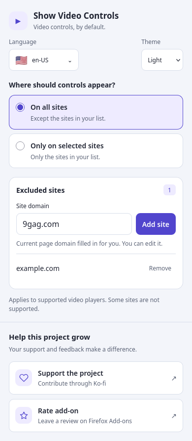
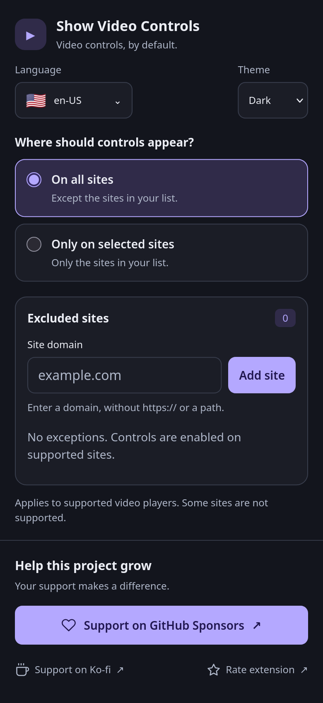

# Show Video Controls for Firefox

**Stop hunting for video controls. Start watching your way.**

A video starts playing, but its playback controls are missing. Show Video Controls
for Firefox automatically enables native controls on supported HTML videos so you
can pause, seek, adjust the volume, or enter fullscreen when the player and platform
support it.

Especially useful for WebM clips and sites such as 9GAG. No repeated right-clicks
or “Show controls” steps for each video.

**[Get it on Firefox Add-ons](https://addons.mozilla.org/firefox/addon/show-video-controls-firefox/)**
· [Report a bug](https://github.com/FelipheMP/show-video-controls-firefox/issues/new?template=bug_report.md)
· **[Support on GitHub Sponsors](https://github.com/sponsors/FelipheMP)**
· [Ko-fi](https://ko-fi.com/coreboolean)

## Built for the way you browse

- **Firefox on desktop and Android.** Manage your settings with a compact interface
  and comfortable touch targets.
- **Controls that appear automatically.** The add-on watches for dynamically
  added videos as you browse supported pages.
- **Light on resources.** On sites where the add-on is turned off, it does no work
  on the page. Where it is on, it only looks at newly added content. See
  [Performance](#performance).
- **Your sites, your rules.** Run on supported sites by default, or enable controls
  only for the sites you choose. Each mode keeps its own list.
- **Changes apply right away.** Open pages pick up new site rules and mode changes
  without a reload.
- **An appearance that fits.** Choose Light, Dark, or System and keep that preference
  between sessions.
- **English or Brazilian Portuguese.** Pick **🇺🇸 en-US** or **🇧🇷 pt-BR** from the
  language menu. Switching languages preserves the domain you are typing.
- **Settings stored locally.** Your site lists, language, and theme stay in Firefox's
  local add-on storage.

## A cleaner way to manage your controls

  
  

## Get started

1. Install the add-on from [Firefox Add-ons](https://addons.mozilla.org/firefox/addon/show-video-controls-firefox/).
2. Visit a page with a supported HTML video. Native controls are enabled automatically
   unless the site is excluded.
3. Open **Show Video Controls** from Firefox's extensions menu to customize where it runs.

The current source requires **Firefox 140 or later on desktop** and **Firefox 142
or later on Android**, as declared in [manifest.json](manifest.json).

### Choose where it runs

| Mode | What happens | What your list contains |
| --- | --- | --- |
| **On all sites** — default | Enables controls on supported sites, except those you list. | Excluded sites |
| **Only on selected sites** | Enables controls only on supported sites you list. | Allowed sites |

Enter a domain such as `example.com`, without `https://` or a path, and select
**Add site**. When available, the current page's domain is filled in for you.
Choose **Remove** to delete an entry.

- A base domain such as `example.com` also matches its subdomains.
- Switching modes preserves both lists.
- An empty allowed-sites list enables controls nowhere in **Only on selected sites** mode.
- Open pages follow your changes right away, in both directions: controls appear on
  newly allowed sites and are removed from sites you disable. Controls that a site
  provides itself are never touched. On 9GAG, overlays the add-on removed only come
  back after a reload.

### Make it yours

Use **Language** to choose **en-US** or **pt-BR**, and **Theme** to choose **Light**,
**Dark**, or **System**. English and the system theme are the defaults. Both
preferences are saved automatically.

The language menu supports touch, arrow keys, Enter, and Escape. Click outside the
menu or move focus away to dismiss it.

## Performance

The add-on is designed to stay out of the way, which matters most on phones and
low-power devices.

- **Off means off.** On a site that is excluded (or not in your allowed list), the
  page script reads your settings once and stops. It does not observe the page or scan
  for videos. The only thing left is a lightweight listener that wakes up when you
  change one of this add-on's settings.
- **No background script.** The add-on runs only as a page script and a popup, so
  nothing stays active in the browser between pages.
- **Settings are read once**, then cached for the life of the page, instead of being
  read again on every page change.
- **Only new content is inspected.** When a page adds elements, the add-on checks just
  those elements for videos, never the whole document.
- **Work is batched.** Changes are handled at most once per animation frame, and
  Firefox pauses animation frames in background tabs, so hidden tabs use no extra CPU.

## Compatibility and limitations

This add-on enables the browser's native controls on HTML `<video>` elements.
It does not replace a website's player or add a new playback engine.

- **Custom players may not work.** Sites can use their own overlays or player logic
  that hides, replaces, or interferes with native controls.
- **Some sites are excluded by design.** The manifest excludes several major video
  services, including YouTube, Netflix, Vimeo, and Twitch. Adding one of those sites
  to your allowed list does not override the manifest exclusions.
- **Protected Firefox pages cannot be modified.** The site-list form also rejects
  local domains and IP addresses.
- **Controls vary by platform and media.** Available actions depend on Firefox,
  the video, and the surrounding player.

See [manifest.json](manifest.json) for the complete URL exclusions. If controls
are missing on another site, [report the issue](https://github.com/FelipheMP/show-video-controls-firefox/issues/new?template=bug_report.md)
with the page URL, Firefox version, platform, and steps to reproduce it.

## Permissions and privacy

| Permission | Why it is used |
| --- | --- |
| `activeTab` | Reads the active page's domain to prefill the site-list form. |
| `storage` | Saves site rules, language, and appearance locally. |

The page script is registered for all websites (`<all_urls>`) through the manifest's
`content_scripts` entry, minus the exclusions listed there. That match is what lets it
find supported video elements and enable controls on pages where the add-on is allowed
to run. The Firefox manifest also lists `<all_urls>` under `host_permissions`, which
Manifest V3 on Firefox needs for a page script to run. The Chromium package does not
declare it, because Chromium does not require it.

The add-on code does not send browsing activity or settings to an analytics
service. The manifest declares that no data collection is required. The optional
support and review links open GitHub Sponsors, Ko-fi, and Firefox Add-ons in a new tab
(the Chromium package has no review link until a store page exists). See the full
[privacy policy](PRIVACY.md).

## Help this project grow

If this add-on makes your browsing easier, there are two ways to help:

- **[Support the project on GitHub Sponsors](https://github.com/sponsors/FelipheMP)**,
  the preferred way to contribute to its continued development.
  You can also [contribute through Ko-fi](https://ko-fi.com/coreboolean).
- **[Rate it on Firefox Add-ons](https://addons.mozilla.org/firefox/addon/show-video-controls-firefox/)**
  and share your experience with other Firefox users.

Bug reports and feature ideas are welcome too:
[report a bug](https://github.com/FelipheMP/show-video-controls-firefox/issues/new?template=bug_report.md)
or [suggest an improvement](https://github.com/FelipheMP/show-video-controls-firefox/issues/new?template=feature_request.md).

## Develop and contribute

The add-on uses plain HTML, CSS, and JavaScript, with Manifest V3. **No build step or
UI framework is required** to run it in Firefox. Chrome and Edge use a package derived
from the same source by a small, dependency-free Node.js script.

### Run the source locally

1. Clone this repository and open Firefox on desktop.
2. Open `about:debugging#/runtime/this-firefox`.
3. Select **Load Temporary Add-on…** and choose this repository's `manifest.json`.
4. Open the add-on's popup and visit a supported page to try it.

Temporary installations are removed when Firefox restarts. For device testing,
follow Mozilla's [Firefox for Android add-on development guide](https://extensionworkshop.com/documentation/develop/developing-extensions-for-firefox-for-android/).

### Run it in Chrome or Edge

1. Run `node scripts/build-chromium.mjs` (Node.js 18 or later). It writes `dist/chromium/`.
2. Open `chrome://extensions` (or `edge://extensions`) and turn on **Developer mode**.
3. Select **Load unpacked** and choose the `dist/chromium` folder.

Run the script again after every change, then reload the extension. The package differs
from the Firefox source in a few documented ways, listed at the top of the script.

### Find your way around

| File | Responsibility |
| --- | --- |
| [manifest.json](manifest.json) | Firefox requirements, permissions, and script registration (Manifest V3). |
| [_locales](_locales) | Extension name and summary in English and Brazilian Portuguese. |
| [scripts/build-chromium.mjs](scripts/build-chromium.mjs) | Builds the Chrome and Edge package into `dist/chromium/`. |
| [web-ext-config.cjs](web-ext-config.cjs) | Keeps non-add-on files out of the Firefox package. |
| [store](store) | Store listing texts (Chrome, Edge, Firefox) in English and Brazilian Portuguese. |
| [PRIVACY.md](PRIVACY.md) | Privacy policy linked from the stores. |
| [showvideocontrolsbydefault.js](showvideocontrolsbydefault.js) | Page script: site matching, video controls, and site-specific overlay handling. |
| [popup.html](popup.html) | Settings layout, accessible controls, and contribution links. |
| [css/styles.css](css/styles.css) | Responsive layout and light/dark theme tokens. |
| [popup.js](popup.js) | Popup interaction, domain validation, and local storage. |
| [popup-i18n.js](popup-i18n.js) | English and Brazilian Portuguese interface text. |

Keep changes readable and commented. Add matching translation keys to both
language dictionaries, and preserve the existing `mode`, `excludedDomains`, and
`includedDomains` storage keys. The `language` and `theme` keys hold UI preferences.
Use the `api` alias (`globalThis.browser ?? globalThis.chrome`) for extension APIs, never
`browser.*` or `chrome.*` directly, so the same code runs on every browser. If a change
affects behavior that the [store texts](store/README.md) describe, update them in both languages.

When changing the page script, keep it cheap on the pages where it does nothing:
no observers, timers, or scans while a site is disabled, no storage reads inside
DOM callbacks, and no work on nodes that were not added.

### Check your changes

- Test in **Firefox desktop and Firefox for Android**. A Chromium-only check is not
  a substitute for either target. Also load the Chromium package in Chrome or Edge.
- Check both languages and all three themes, including keyboard navigation and
  narrow screens with the on-screen keyboard open.
- Add and remove sites, switch modes, and reopen the popup to verify persistence.
- With a page open, change the mode or site list and confirm the open page follows the
  change without a reload.
- Verify controls on a supported page and confirm that excluded sites stay excluded.
- With Mozilla's `web-ext` available, run `web-ext lint` from the repository root.
  It checks the Firefox package only; the Chromium package is checked by loading it.

For an additional code overview,
[explore the project on DeepWiki](https://deepwiki.com/FelipheMP/show-video-controls-firefox).

## Credits and license

This is an **unofficial Firefox adaptation** of *Show Video Controls by Default*,
originally created by **marcintracz.official** for Chrome.

Licensed under the [GNU General Public License v3.0](LICENSE).